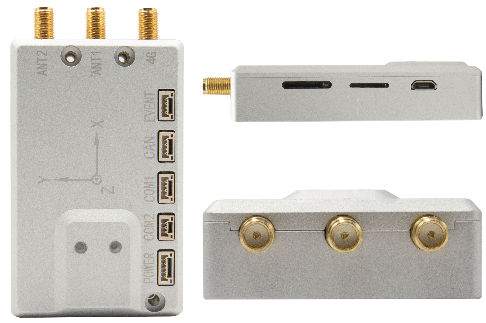

# ROS Wrapper for Femtomes Nano-D Receiver

There are packages for using Femtomes Receiver (Nano-D) with ROS.

This version supports Noetic distribution.

For running in Melodic environment please switch to the [melodic](https://github.com/DapengFeng/femtomes_ros_driver/tree/melodic). 

## Update!

### You can use [nmea_navsat_driver](http://wiki.ros.org/nmea_navsat_driver) for the standard nmea message.

## Requirements

- Hardware
  
  - [Nano-D](http://www.femtomes.com/en/Nano.php?name=Nano)

- Software
  
  - [ROS Noetic on Ubuntu 20.04](http://wiki.ros.org/noetic/Installation/Ubuntu)
  
  - Python3.x

## Install from Sources

1. Create a [catkin](http://wiki.ros.org/catkin#Installing_catkin) workspace

*ubuntu*

```bash
mkdir -p ~/catkin_ws/src
cd ~/catkin_ws/src
```

1. Clone the Femtomes  ROS Driver from [here](https://github.com/DapengFeng/femtomes_ros_driver) into 'catkin_ws/src/' and make

```bash
git clone https://github.com/DapengFeng/femtomes_ros_driver.git
cd ..
catkin_make
```

## Usage Instructions

### Start the femtomes node in ROS:

```bash
roslaunch femtomes_ros_driver femtomes_rtk.launch
```

This will stream femtomes receiver and publish on the appropriate ROS topic.

### Published Topics

- /femtomes/bestxyz ([femtomes_msgs/BESTXYZ](https://raw.githubusercontent.com/DapengFeng/femtomes_ros_driver/main/msg/FemtomesBESTXYZ.msg))

- /femtomes/heading ([femtomes_msgs/HEADING](https://raw.githubusercontent.com/DapengFeng/femtomes_ros_driver/main/msg/FemtomesHEADING.msg))

- /femtomes/odom ([nav_msgs/Odometry](http://docs.ros.org/en/noetic/api/nav_msgs/html/msg/Odometry.html))


